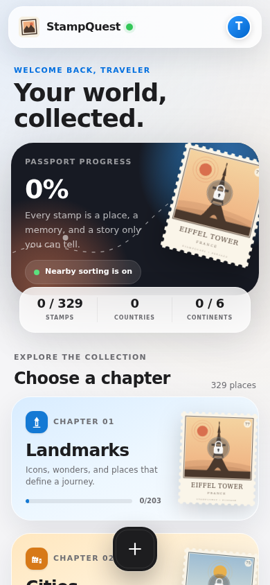
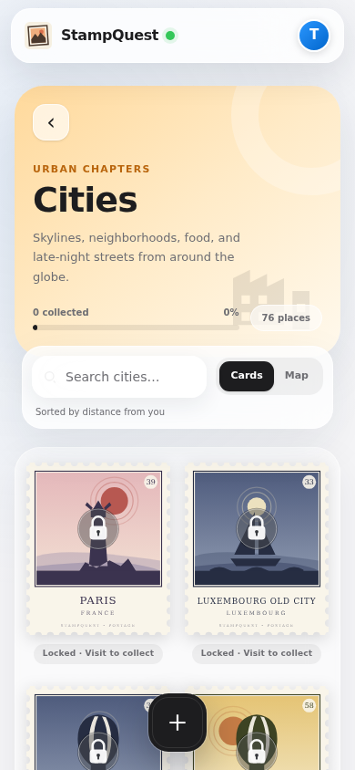
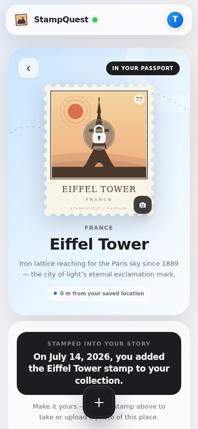
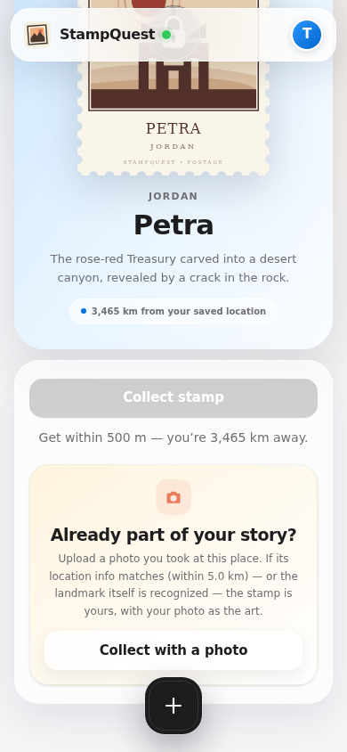

# StampQuest 🗺️

A mobile-first web app where you collect digital stamps from places you visit and build a personal travel passport. Every place begins as an illustrated stamp behind a translucent lock. Get within 500 m, collect it, then take or upload your own photo to replace the illustration and make the stamp yours.

| Passport | Browse nearby | Add your photo | Collect with a photo |
| --- | --- | --- | --- |
|  |  |  |  |

## Features

- **One-time GPS check-in setup** — location is requested once, just after sign-in or sign-up, then retained across pages and refreshes until sign-out. A compact status dot stays green when GPS is available, yellow while setup is pending, and red when location is unavailable. The server re-validates collection distance so the client can't be trivially spoofed.
- **Remote collection with photo evidence** — no GPS needed: upload a photo you already have of the place. It's accepted if the photo's own EXIF location is near the place, or (with photo verification configured) if the photo visibly shows the landmark.
- **Illustrated, locked stamps** — every place immediately shows its own colorful travel-poster artwork beneath a translucent glass lock, so the passport stays visual before anything has been collected.
- **Your photo is the stamp** — the first photo you add for a place — from collecting in person or via photo evidence — replaces the built-in illustration and removes its lock, inside the same vintage postage-stamp frame.
- **329 curated places** — 203 landmarks, 76 cities, and one iconic stop in each of the 50 U.S. states — spanning Asia, Europe, the Americas, Africa, and Oceania. Each has deterministic illustrated artwork until you fill it with your own photo.
- **Custom places with smart location** — add your own café, trailhead, or rooftop from the floating **+** button. Coordinates can come from a photo's embedded GPS, a user-triggered place/address lookup, saved live GPS, or a manual correction. Each place gets a generated stamp and stays private to your account.
- **Simple accounts** — sign up with just a username and password. Your stamps, custom places, and photos are private to your account; no third-party sign-in required. The static Pages build provides the same account gate locally with PBKDF2-hashed passwords and per-account device storage.
- **Profile photo** — tap your avatar in the top-right corner or on the profile tab to add or replace your profile picture.
- **Immersive home landing page** — an editorial travel hero, animated route, live collection progress, and three visual passport chapters — Landmarks, Cities, US States — each opening into its own browsing page.
- **Refresh returns home** — a full browser refresh always reopens the main passport landing page; normal in-app navigation still preserves the selected place or category.
- **Browse by Landmarks, Cities, or US States** — each category page offers a **card or map view** (the map is a real pannable/zoomable Leaflet map with OpenStreetMap tiles, lazy-loaded so it never costs anyone who stays on card view), plus its own search.
- **Metric or imperial** — a units toggle on your profile switches every distance in the app (collect radius, "how far away," photo-match radius) between the two, remembered per device.
- **Personal passport** — your home page's stats strip tracks stamps, countries, and continents traveled; your profile shows a 3-column gallery of everything you've collected plus the custom places you've added.
- **Globe-trotting intro** — a one-time animated splash (spinning globe, orbiting plane, landmarks lighting up across every continent) plays when you enter the app, then fades into your passport underneath.
- **Cinematic Apple-style interface** — system typography, floating frosted navigation, atmospheric gradients, tactile stamp albums, bold destination heroes, and restrained motion make every page feel like a modern travel journal.
- **Installable PWA** — add to home screen, standalone display, offline app shell.
- **Self-contained backend** — Node + Express + SQLite in this repo. No third-party services required.

## Stack

- `client/` — Vite, React 19, TypeScript, Tailwind CSS v4, react-router, vite-plugin-pwa, `framer-motion` for animation, `leaflet`/`react-leaflet` for the map view (code-split, only loaded when opened), `exifr` for reading a photo's embedded GPS, and Web Crypto for hashed local-mode accounts
- `server/` — Express 5, better-sqlite3, session cookies (httpOnly), scrypt password hashing via `node:crypto`, optional Gemini/Hugging Face vision check for photo-evidence collection
- `e2e/` — Playwright suite with mocked geolocation at phone viewport

## Quickstart

```bash
npm install
npm run dev
```

- App: http://localhost:5173 (Vite dev server, proxies `/api` to the API on :3001)
- The SQLite database is created and seeded automatically at `server/data/stampquest.db`.

> **Testing on a real phone:** browser geolocation only works in secure contexts — `localhost` is exempt, but a LAN IP (`http://192.x.x.x:5173`) is not. Use an HTTPS tunnel (e.g. `cloudflared tunnel`, `ngrok`) or deploy. On iOS, the one-time location setup is shown after authentication and permission is requested only after its button is tapped.

## Production

```bash
npm run build
NODE_ENV=production PORT=3001 npm start
```

One process serves everything: the built client, the SPA fallback, and the `/api` routes.

| Env var | Default | Purpose |
| --- | --- | --- |
| `PORT` | `3001` | HTTP port |
| `DATABASE_PATH` | `server/data/stampquest.db` | SQLite file location |
| `NODE_ENV` | — | `production` enables `Secure` session cookies (requires HTTPS) |
| `GOOGLE_API_KEY` | — | Optional. Gemini API key — primary provider for the landmark-recognition path in photo-evidence collection. |
| `GOOGLE_MODEL` | `gemini-2.0-flash` | Gemini model used for the landmark vision check |
| `HUGGINGFACE_API_KEY` | — | Optional. Secondary/fallback vision provider, used if Gemini is unset or a request to it fails. |
| `HUGGINGFACE_MODEL` | `Qwen/Qwen2-VL-72B-Instruct` | Hugging Face model used for the fallback landmark vision check |
| `GEOCODER_URL` | `https://nominatim.openstreetmap.org/search` | Optional runtime override for the server-side custom-place geocoder. |
| `GEOCODER_USER_AGENT` | `StampQuest/0.1 (+repository URL)` | Identifies server-side geocoding requests; customize this with a deployment contact URL. |

**Deploying free:** the app is a single Node service, so Render/Fly.io/Railway free tiers all work. Two things to remember: (1) point `DATABASE_PATH` at a **persistent disk/volume** — ephemeral filesystems reset the database on every deploy; (2) serve over **HTTPS**, or geolocation (and Secure cookies) won't work.

### GitHub Pages (static demo mode)

Every push to the default branch runs `.github/workflows/deploy-pages.yml`, which publishes a static build to **https://shrlak.github.io/passport/**.

GitHub Pages can't run the Node API, so this build swaps in a browser backend (`VITE_BACKEND=local`). It has a real local sign-up/sign-in gate: passwords are salted and PBKDF2-hashed with Web Crypto, and each account gets isolated stamps, custom places, profile photo, and stamp photos. Data remains on that browser/device, so there is no cross-device sync. The 500 m and photo-radius checks run client-side, and photo evidence uses EXIF GPS only because Gemini/Hugging Face verification requires the Node server. User-triggered custom-place searches call the configured geocoder directly, with a browser cache and one-request-per-second throttle. Since Pages serves over HTTPS, GPS collection and PWA installation work on phones.

The workflow publishes the build to a `gh-pages` branch, which GitHub picks up automatically. If the site doesn't appear after the first successful run, enable it once by hand — repo **Settings → Pages → Deploy from a branch → `gh-pages` / root** — later deploys are automatic.

To try the static build locally: `VITE_BACKEND=local npm run build -w client && npm run preview -w client`.

## How collecting works

1. Immediately after sign-in or sign-up, the app offers one-time location setup. A button tap requests the browser permission; accepted coordinates are retained for that signed-in account across navigation and refreshes, then cleared on sign-out.
2. `POST /api/places/:id/collect` sends your coordinates.
3. The server computes the Haversine distance to the place and rejects anything over **500 m** (`403 TOO_FAR`), duplicates (`409 ALREADY_COLLECTED`), and places you can't see (`404`).
4. The stamp row stores when and roughly where you collected it.

The radius lives in `server/src/geo.ts` (authoritative) and is mirrored in `client/src/lib/geo.ts` (UI gating only). This is honor-system-hardened, not fraud-proof — device-level GPS spoofing is out of scope.

## Locating a custom place

The **Create your own** sheet resolves coordinates in four ways:

1. **Photo GPS** — `exifr` reads embedded EXIF coordinates locally; the selected image is not uploaded by this step.
2. **Typed lookup** — the place name, city/region/address, and country are matched against the StampQuest catalog first, then sent through a one-result OpenStreetMap Nominatim lookup when needed. Results are approximate and remain editable through manual coordinates.
3. **Saved GPS** — use the live coordinates retained for the current signed-in session.
4. **Manual coordinates** — enter an exact latitude and longitude.

Typed lookup happens only when the traveler taps **Find typed place** or submits without another location source—never as autocomplete or a background request. Server and static modes cache results and serialize public Nominatim requests to at most one per second, with visible [OpenStreetMap attribution](https://www.openstreetmap.org/copyright). Deployments expecting meaningful lookup traffic should point `GEOCODER_URL` (and `VITE_GEOCODER_URL` for a static build) at a geocoder they operate or contract for.

### Collecting remotely, with a photo

On any place you haven't collected yet, the detail page offers **"Collect with a photo"** — for the landmarks you've already visited, or ones you have an old photo of. `POST /api/places/:id/collect-photo` accepts the image and grants the stamp if either check passes:

1. **EXIF GPS match** — the client reads the photo's embedded location (`client/src/lib/exif.ts`, via `exifr`) and sends it alongside the image. If it's within **5 km** of the place (`PHOTO_RADIUS_M` in `server/src/geo.ts` — more generous than live GPS, since landmark photos are often taken from a viewpoint some distance away), the stamp is granted immediately.
2. **Landmark recognition** — if there's no usable EXIF location (or it doesn't match), `server/src/landmark.ts` asks Gemini when `GOOGLE_API_KEY` is configured, then falls back to Hugging Face when `HUGGINGFACE_API_KEY` is available. A confident match grants the stamp.

Either way, the uploaded photo becomes the stamp's artwork — same as collecting in person and adding a photo afterward. Without either vision provider configured, only the EXIF path is available, and the UI explains that when a photo is rejected for having no location data.

## Navigation

Signed-in visitors land on the home page: a stats strip, then three cards — **Landmarks**, **Cities**, **US States**. Tapping a card opens that category's own page (with a back chevron to return home); it isn't reachable any other way. Two things stay on screen everywhere in the app: your profile avatar, top-right, and a circular **+** button, bottom-center, which pops up the add-a-place form without leaving the page you're on.

## Browsing by category

The curated roster is tagged with a `category` — `landmark`, `city`, or `us-state`. Custom places you add default to `landmark`. Each category page offers:

- **Card view** — the same 2-column stamp grid as your passport, with every built-in illustration kept visible beneath a translucent lock until a personal photo replaces it. Places are sorted by distance once you've granted location, alphabetical otherwise.
- **Map view** — a real Leaflet map with OpenStreetMap tiles and a pin per place; tap a pin to jump to that place's detail page. The map library is dynamically imported, so it only downloads if you actually open map view.

## Units

A Metric/Imperial toggle on the profile page (persisted in `localStorage`) controls every distance shown in the app — the collect radius, "how far away you are," and the photo-match radius. The underlying constants (`COLLECT_RADIUS_M`, `PHOTO_RADIUS_M`) and all server-side distance math stay in meters regardless; this only changes display formatting.

## Data model

- `users` — username (unique, 3–24 chars), scrypt password hash, plus an optional profile `photo` BLOB (`photo_mime`, `photo_updated_at`), served via `GET /api/auth/me/photo`
- `sessions` — random 32-byte tokens, 30-day expiry, httpOnly cookie
- `places` — curated seed (`is_curated=1`, `art_key` → client art registry) or user-created (`created_by`, private to creator), tagged with a `category` and a nullable full `state` name for the 50 U.S.-state entries
- `stamps` — `UNIQUE(user_id, place_id)`, collection time + coordinates + distance, plus an optional `photo` BLOB (`photo_mime`, `photo_updated_at`) — the user's own photo of the place, served via `GET /api/places/:id/photo`

The schema is applied idempotently on boot, including additive migrations for `category`, `state`, and photo fields. Curated records are synchronized by name and country on every boot, so an existing database receives newly added cities and state labels without replacing user-created places or collected stamps. The current roster is 329 places: 203 landmarks, 76 cities, and 50 state entries.

## Tests

```bash
npx playwright install chromium   # once
npm run e2e
```

The suite builds the client, boots the server on a throwaway database (with `GOOGLE_API_KEY`/`HUGGINGFACE_API_KEY` unset, so the landmark-recognition path is deterministically off), and drives the real app at 390×844 with mocked geolocation: unauthenticated route gate → registration → one-time location onboarding and red/yellow/green status states → home landing page (329-place stats and category cards) → the Landmarks card's card and map views → in-range detection at the Eiffel Tower → collect → verify its built-in illustration and translucent lock → add a photo, which replaces both → location and collection persistence across reload → the 76-city and 50-state collections (including state-name labels) → custom place creation from both photo EXIF and typed catalog lookup → the profile's collected-stamps gallery, units toggle, profile-photo upload, location cleanup, and sign-out → **server-side rejection of far-away coordinates** → **remote collection via matching photo EXIF GPS**, plus rejection of a too-far or location-less photo → account privacy checks.

## Stamp art

Every stamp's frame — perforated edges, palette, caption band, illustration, and album tilt — is generated deterministically from the place's identity. An FNV-1a hash selects the palette, denomination, and fallback scene motif; recognized landmarks use hand-authored silhouette paths from `client/src/art/landmarks.ts`. Before a traveler adds a photo, that artwork remains visible beneath a centered translucent lock. Collecting records the visit, but the lock intentionally stays in place until the traveler takes or uploads their own image. That image then replaces the illustration and the lock disappears. The hidden `/gallery` route remains a lock-free QA sheet for the complete illustration system.

The original picture-stamp mark is shared by the frosted top bar, favicon, and install icons. Regenerate the PNG variants with `npm run gen-icons` (requires Playwright's Chromium).
